# ASUR — Business Flow Diagrams

> All diagrams use [Mermaid](https://mermaid.js.org/) syntax — renders on GitHub, VS Code (Mermaid extension), Notion, and most modern docs tools.

---

## 1. Customer Purchase Journey (Happy Path)

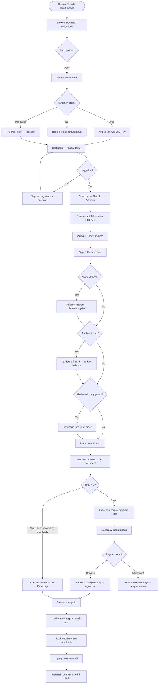

---

## 2. Order Status Lifecycle

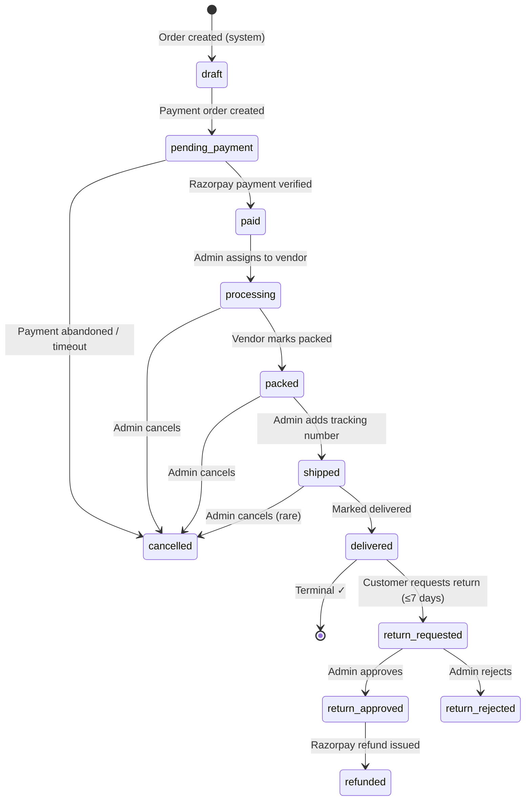

---

## 3. Admin Order Management Flow

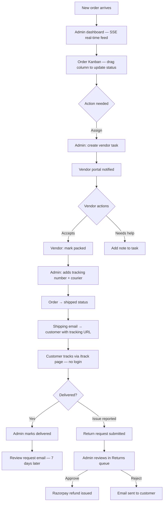

---

## 4. Inventory Management Flow

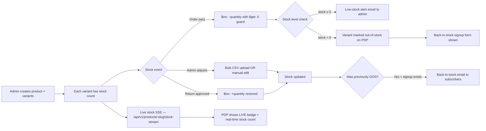

---

## 5. Customer Retention Flow (Email & Loyalty)

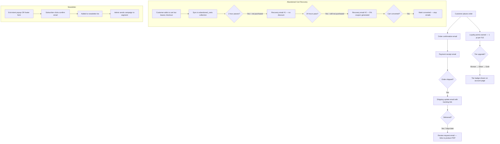

---

## 6. Referral & Loyalty Points Flow

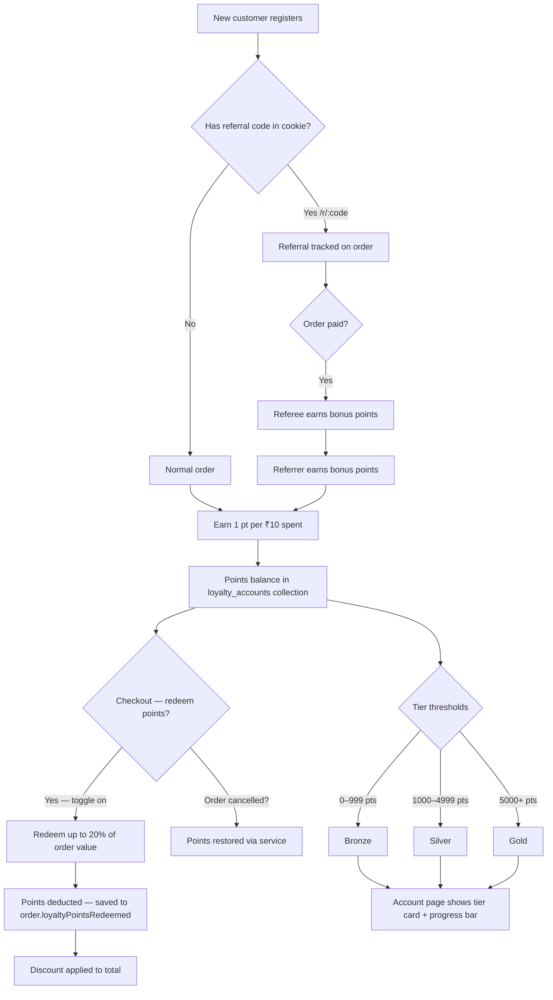

---

## 7. Content & Editorial Flow (Articles + Drops)

```mermaid
flowchart TD
    A[Admin creates Article in CMS] --> B{Article type}
    B -->|Blog / Journal| C[Published to /journal/:slug]
    B -->|Drop article| D[Set countdown date + access code]
    
    D --> E{Drop date reached?}
    E -->|Before| F["/drops/:slug shows countdown timer"]
    E -->|After| G[Products associated with drop go live]
    
    D --> H{Access code set?}
    H -->|Yes| I[AccessGate component on drop page]
    I --> J[Customer enters code → sessionStorage unlock]
    J --> K[Full drop content + products revealed]
    H -->|No| L[Drop page publicly accessible]
    
    C --> M[/journal page lists all articles]
    M --> N[Homepage shows 3 recent articles]
    
    A --> O[Admin can: publish / archive / set hero image]
    O --> P[SiteConfig singleton — announcement bar text]
    P --> Q[Header announcement bar on all pages]
```

---

## 8. AI Features Flow

```mermaid
flowchart TD
    subgraph "PDP — Size Recommendation"
        A[Customer opens AI Size Finder] --> B[Enters height + weight + fit preference]
        B --> C[POST /api/v1/ai/size-rec]
        C --> D[Claude Haiku — prompt with sizes array]
        D --> E[Returns recommended size + reason]
        E --> F[Customer can tap 'Select X' to auto-select]
    end
    
    subgraph "Products Page — Visual Search"
        G[Customer taps camera icon] --> H[Uploads or takes photo]
        H --> I[Image → base64 → POST /api/v1/ai/visual-search]
        I --> J[Claude Vision — describe what clothing item this is]
        J --> K[Search query built from description]
        K --> L[Returns matching products]
    end
    
    subgraph "Admin — Description Generator"
        M[Admin fills product title + tags + fit] --> N[Clicks '✦ Generate with AI']
        N --> O[POST /api/v1/ai/description-gen]
        O --> P[Claude Haiku — brand-voice prompt]
        P --> Q[Generated description inserted into form]
    end
```

---

## 9. Vendor Task Flow

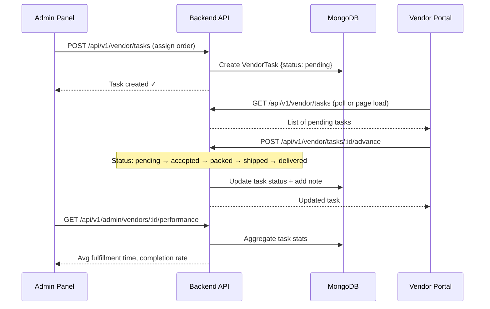

---

## 10. Authentication Flow

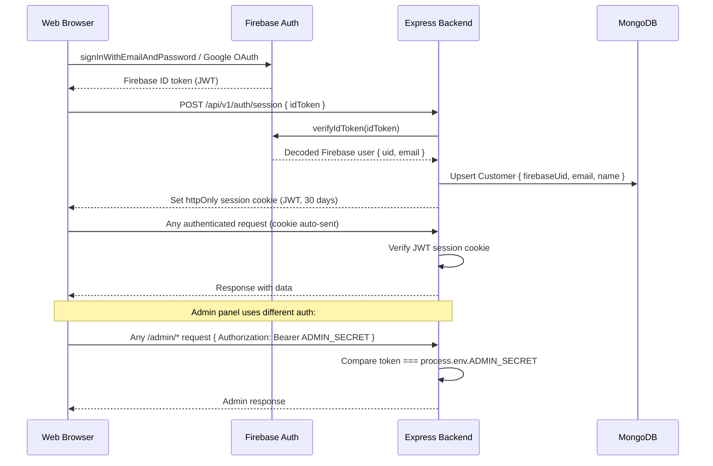

---

## 11. Payment Flow (Razorpay)

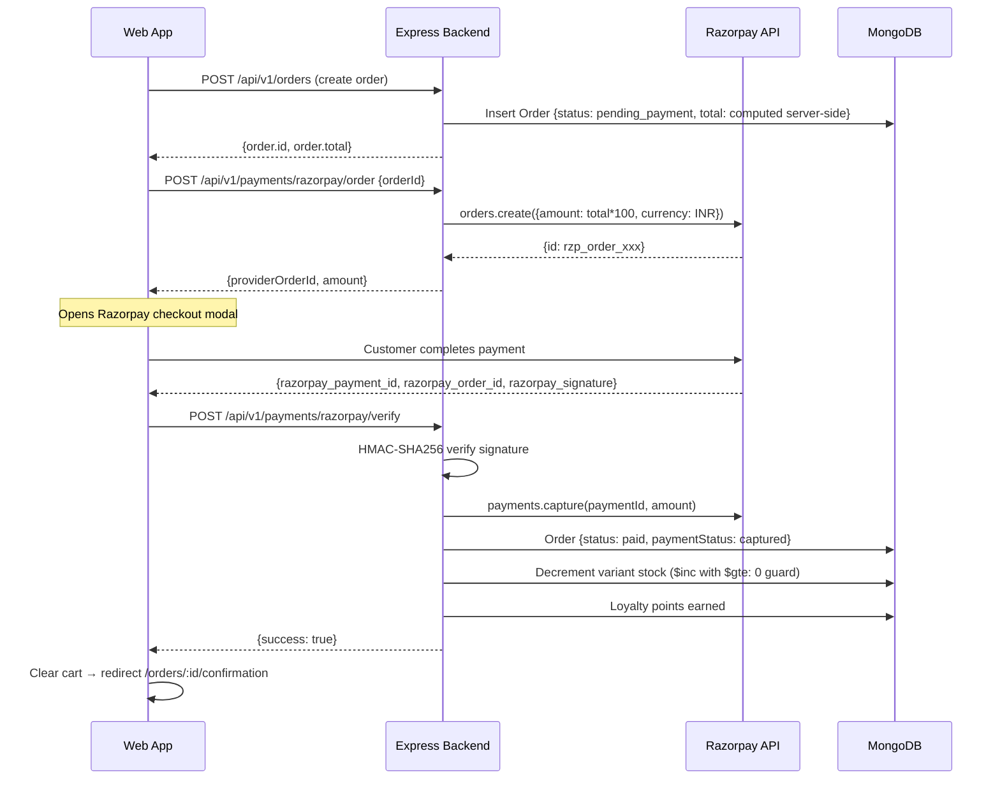

---

## 12. Return & Refund Flow

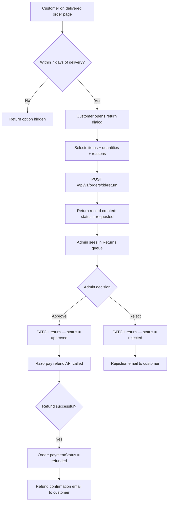
